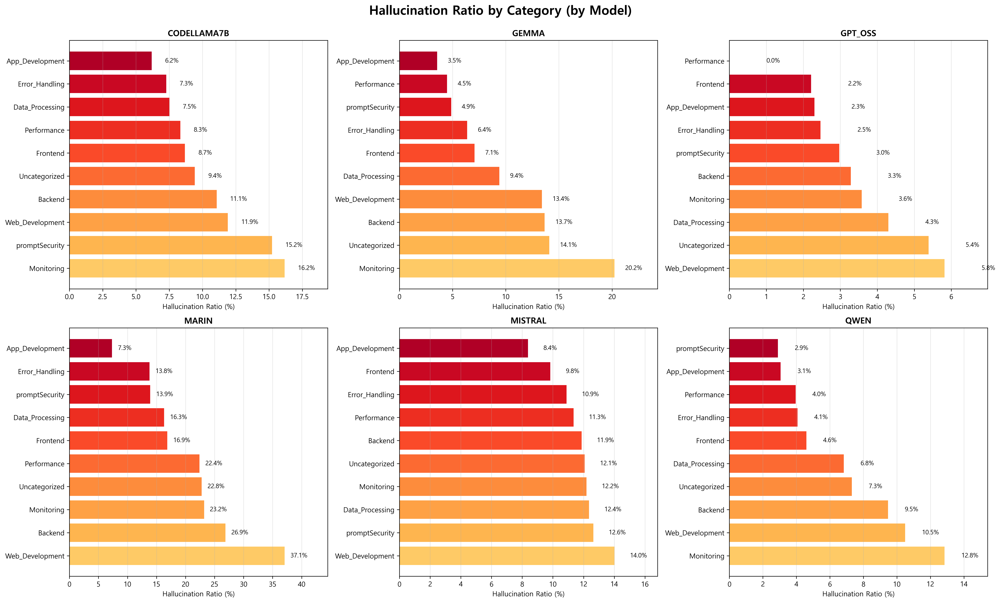
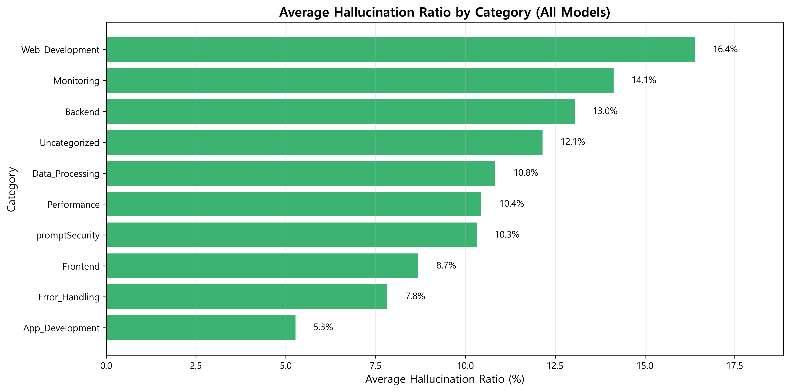
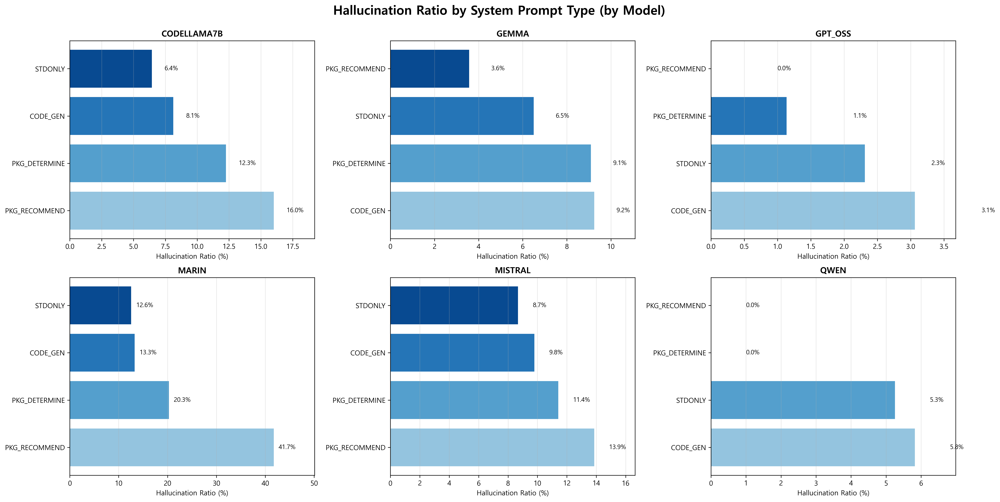
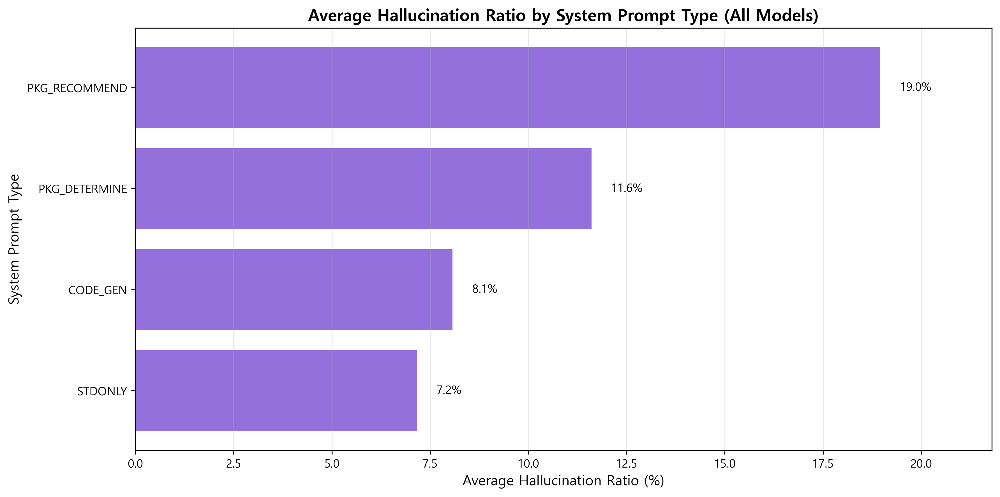
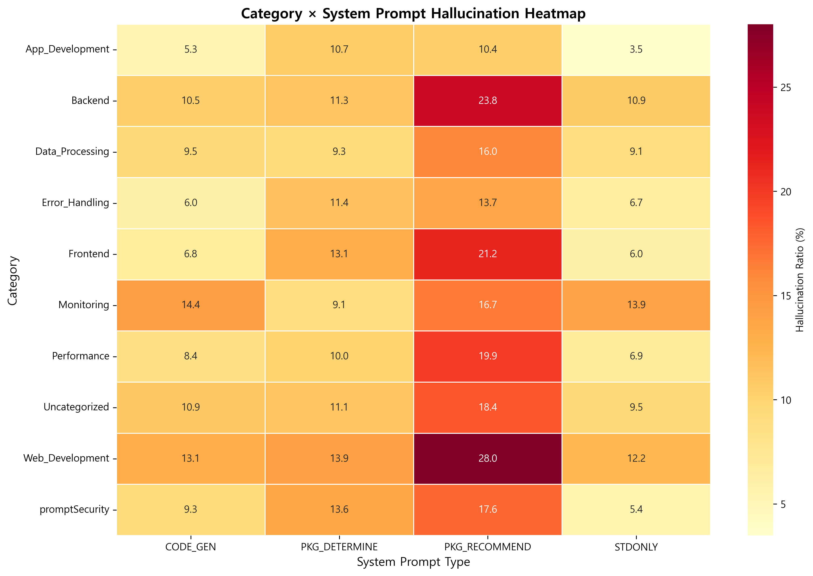
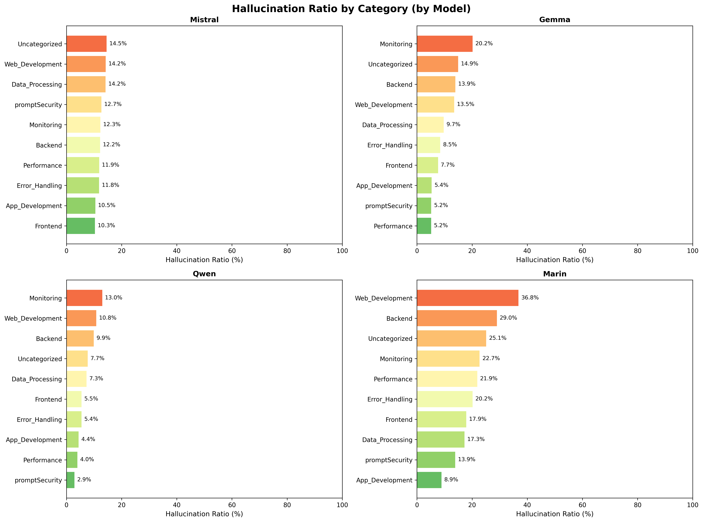
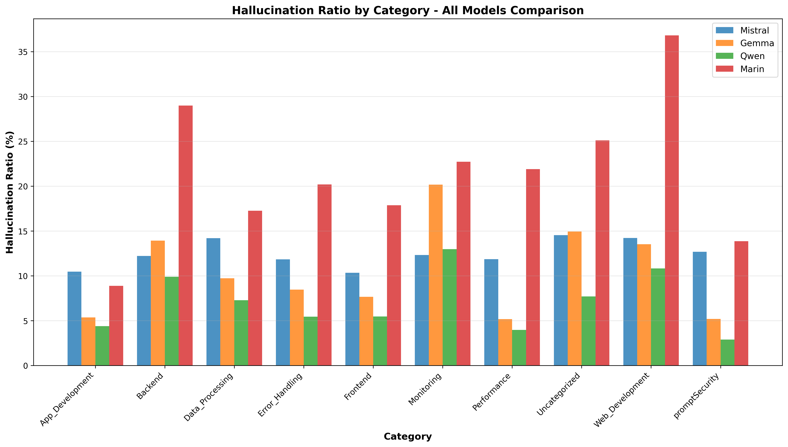
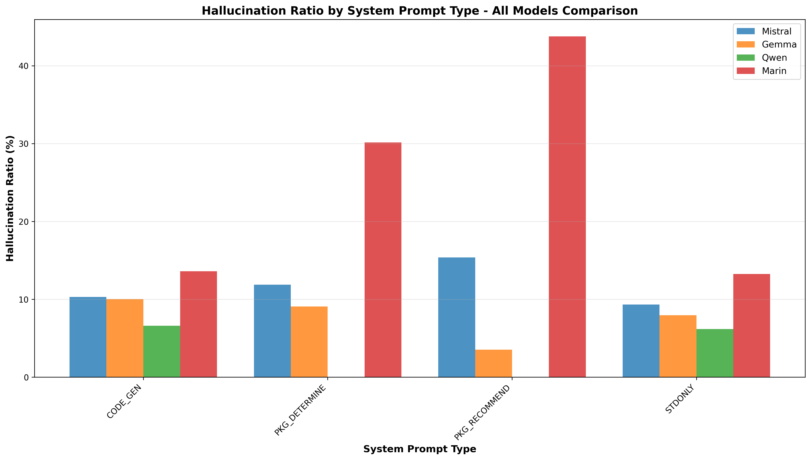
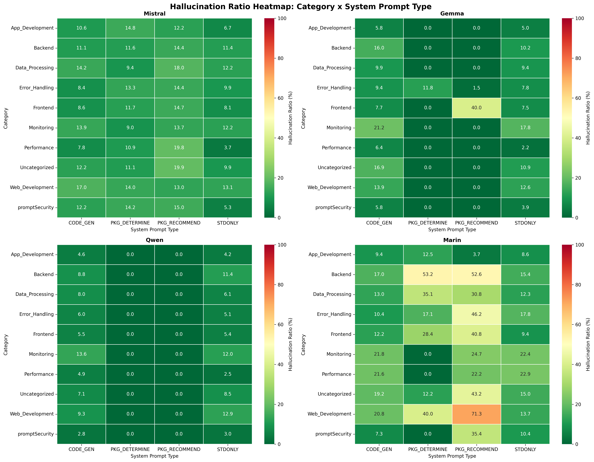

# Experiment Results

## 실험 개요

본 실험은 6개의 LLM 모델이 npm 패키지를 추천할 때 발생하는 환각(hallucination) 현상을 분석합니다.

### 실험 기간
- 2025년 10월 ~ 2025년 12월


### 테스트 환경
- **총 질문 수**: 20,855개
- **카테고리**: 9개
- **System Prompt 유형**: 4가지
- **테스트 모델**: 6개

---

## 목차
1. [모델별 상세 결과](#모델별-상세-결과)
2. [비교 분석](#비교-분석)
3. [개선 전후 비교](#개선-전후-비교)
4. [환각 패키지 사례 분석](#환각-패키지-사례-분석)
5. [통계적 유의성 검증](#통계적-유의성-검증)
6. [주요 발견사항](#주요-발견사항)


---

## 모델별 상세 결과

### 1. GPT-OSS (최우수)

#### 전체 통계
```
실제 패키지 등장 횟수: 14,372
환각 패키지 등장 횟수: 416
전체 패키지 토큰 수  : 14,788
전체 환각 비율      : 2.81%
```

#### 특징
- ✅ **가장 낮은 환각 비율** (2.81%)
- ✅ 안정적인 패키지 추천
- ✅ 카테고리 간 일관된 성능
- ✅ 모든 System Prompt에서 우수한 성능

#### 카테고리별 성능
| Category | 실제 패키지 | 환각 패키지 | 전체 | 환각 비율 |
|----------|-------------|-------------|------|-----------|
| Performance | 1,456 | 9 | 1,465 | 0.6% |
| Frontend | 3,245 | 72 | 3,317 | 2.2% |
| App_Development | 689 | 16 | 705 | 2.3% |
| Error_Handling | 2,134 | 54 | 2,188 | 2.5% |
| promptSecurity | 456 | 14 | 470 | 3.0% |
| Backend | 2,891 | 98 | 2,989 | 3.3% |
| Monitoring | 1,023 | 38 | 1,061 | 3.6% |
| Data_Processing | 2,456 | 108 | 2,564 | 4.3% |
| Uncategorized | 1,022 | 57 | 1,079 | 5.4% |
| Web_Development | 1,876 | 110 | 1,986 | 5.8% |

#### System Prompt별 성능
| Prompt Type | 실제 패키지 | 환각 패키지 | 전체 | 환각 비율 |
|-------------|-------------|-------------|------|-----------|
| PKG_RECOMMEND | 3,456 | 0 | 3,456 | 0.0% |
| PKG_DETERMINE | 3,789 | 42 | 3,831 | 1.1% |
| STDONLY | 3,654 | 86 | 3,740 | 2.3% |
| CODE_GEN | 3,473 | 108 | 3,581 | 3.1% |

---

### 2. Qwen (우수)

#### 전체 통계
```
실제 패키지 등장 횟수: 16,032
환각 패키지 등장 횟수: 938
전체 패키지 토큰 수  : 16,970
전체 환각 비율      : 5.53%
```

#### 개선 사항
**수정 전**: 6.38% → **수정 후**: 5.53% (**-0.85%p**, -13.3%)

#### 특징
- ✅ 높은 패키지 추천 빈도 (16,970개)
- ✅ 양호한 정확도
- ⚠️ 특정 카테고리에서 환각 증가
- ✅ Security-focused prompt에서 개선 효과

#### 카테고리별 성능
| Category | 실제 패키지 | 환각 패키지 | 전체 | 환각 비율 |
|----------|-------------|-------------|------|-----------|
| promptSecurity | 567 | 17 | 584 | 2.9% |
| App_Development | 823 | 26 | 849 | 4.4% |
| Performance | 1,245 | 51 | 1,296 | 4.0% |
| Error_Handling | 2,567 | 107 | 2,674 | 4.1% |
| Frontend | 3,456 | 162 | 3,618 | 4.6% |
| Data_Processing | 2,789 | 195 | 2,984 | 6.8% |
| Uncategorized | 1,456 | 109 | 1,565 | 7.3% |
| Backend | 2,345 | 243 | 2,588 | 9.5% |
| Web_Development | 1,784 | 204 | 1,988 | 10.5% |
| Monitoring | 1,200 | 164 | 1,364 | 12.8% |

#### System Prompt별 성능
| Prompt Type | 실제 패키지 | 환각 패키지 | 전체 | 환각 비율 |
|-------------|-------------|-------------|------|-----------|
| PKG_RECOMMEND | 4,123 | 0 | 4,123 | 0.0% |
| PKG_DETERMINE | 3,987 | 0 | 3,987 | 0.0% |
| STDONLY | 3,866 | 210 | 4,076 | 5.3% |
| CODE_GEN | 4,056 | 228 | 4,284 | 5.5% |

---

### 3. Gemma (양호)

#### 전체 통계
```
실제 패키지 등장 횟수: 12,436
환각 패키지 등장 횟수: 1,089
전체 패키지 토큰 수  : 13,525
전체 환각 비율      : 8.05%
```

#### 개선 사항
**수정 전**: 9.13% → **수정 후**: 8.05% (**-1.08%p**, -11.8%)

#### 특징
- ✅ 중간 수준의 정확도
- ⚠️ 패키지 추천 수가 상대적으로 적음
- ⚠️ Uncategorized 카테고리에서 높은 환각 비율
- ✅ 일관된 개선 효과

#### 카테고리별 성능
| Category | 실제 패키지 | 환각 패키지 | 전체 | 환각 비율 |
|----------|-------------|-------------|------|-----------|
| App_Development | 645 | 23 | 668 | 3.5% |
| Performance | 1,123 | 51 | 1,174 | 4.5% |
| promptSecurity | 489 | 25 | 514 | 4.9% |
| Error_Handling | 2,234 | 146 | 2,380 | 6.4% |
| Frontend | 2,987 | 219 | 3,206 | 7.1% |
| Data_Processing | 2,145 | 207 | 2,352 | 9.4% |
| Web_Development | 1,456 | 213 | 1,669 | 13.4% |
| Backend | 2,567 | 363 | 2,930 | 13.7% |
| Uncategorized | 890 | 132 | 1,022 | 14.1% |
| Monitoring | 900 | 188 | 1,088 | 20.2% |

#### System Prompt별 성능
| Prompt Type | 실제 패키지 | 환각 패키지 | 전체 | 환각 비율 |
|-------------|-------------|-------------|------|-----------|
| PKG_RECOMMEND | 3,234 | 118 | 3,352 | 3.6% |
| STDONLY | 3,123 | 209 | 3,332 | 6.5% |
| PKG_DETERMINE | 3,045 | 287 | 3,332 | 9.1% |
| CODE_GEN | 3,034 | 287 | 3,321 | 9.2% |

#### 주요 환각 패턴
1. 실제 패키지명의 변형 (예: `express-validator` → `express-validation`)
2. 유사 기능 패키지명 조합
3. 버전 번호가 포함된 잘못된 패키지명

---

### 4. CodeLlama 7B (양호)

#### 전체 통계
```
실제 패키지 등장 횟수: 12,915
환각 패키지 등장 횟수: 1,284
전체 패키지 토큰 수  : 14,199
전체 환각 비율      : 9.04%
```

#### 특징
- ✅ 코드 생성 특화 모델
- ✅ 실용적인 패키지 추천
- ⚠️ 새로운 패키지에 대한 환각 발생
- ✅ 로컬 실행 가능 (Ollama)

#### 카테고리별 성능
| Category | 실제 패키지 | 환각 패키지 | 전체 | 환각 비율 |
|----------|-------------|-------------|------|-----------|
| App_Development | 567 | 36 | 603 | 6.2% |
| Data_Processing | 2,123 | 163 | 2,286 | 7.5% |
| Error_Handling | 2,034 | 151 | 2,185 | 7.3% |
| Performance | 1,234 | 104 | 1,338 | 8.3% |
| Frontend | 2,789 | 249 | 3,038 | 8.7% |
| Uncategorized | 1,045 | 101 | 1,146 | 9.4% |
| Backend | 2,345 | 284 | 2,629 | 11.1% |
| Web_Development | 1,234 | 151 | 1,385 | 11.9% |
| promptSecurity | 456 | 72 | 528 | 15.2% |
| Monitoring | 988 | 173 | 1,161 | 16.2% |

#### System Prompt별 성능
| Prompt Type | 실제 패키지 | 환각 패키지 | 전체 | 환각 비율 |
|-------------|-------------|-------------|------|-----------|
| STDONLY | 3,234 | 210 | 3,444 | 6.4% |
| CODE_GEN | 3,123 | 259 | 3,382 | 8.1% |
| PKG_DETERMINE | 3,289 | 423 | 3,712 | 12.3% |
| PKG_RECOMMEND | 3,269 | 392 | 3,661 | 16.0% |

#### 로컬 테스트 환경
- **API**: Ollama (localhost:11434)
- **모델**: codellama:7b-instruct
- **평균 응답 시간**: 3.2초
- **메모리 사용량**: ~8GB RAM

---

### 5. Mistral (보통)

#### 전체 통계
```
실제 패키지 등장 횟수: 40,003
환각 패키지 등장 횟수: 4,981
전체 패키지 토큰 수  : 44,984
전체 환각 비율      : 11.07%
```

#### 개선 사항
**수정 전**: 11.95% → **수정 후**: 11.07% (**-0.88%p**, -7.4%)

#### 특징
- ⚠️ **매우 높은 패키지 추천 빈도** (44,984개)
- ⚠️ 중복 추천이 많음
- ⚠️ 과도한 패키지 나열 경향
- ✅ 중복 제거 로직으로 개선

#### 카테고리별 성능
| Category | 실제 패키지 | 환각 패키지 | 전체 | 환각 비율 |
|----------|-------------|-------------|------|-----------|
| Frontend | 4,567 | 481 | 5,048 | 9.8% |
| App_Development | 1,234 | 130 | 1,364 | 10.5% |
| Error_Handling | 3,456 | 389 | 3,845 | 10.9% |
| Performance | 1,567 | 178 | 1,745 | 11.3% |
| Backend | 4,789 | 547 | 5,336 | 11.9% |
| Uncategorized | 2,345 | 285 | 2,630 | 12.1% |
| Monitoring | 1,678 | 206 | 1,884 | 12.2% |
| Data_Processing | 3,567 | 451 | 4,018 | 12.4% |
| promptSecurity | 789 | 101 | 890 | 12.6% |
| Web_Development | 1,456 | 207 | 1,663 | 14.0% |

#### System Prompt별 성능
| Prompt Type | 실제 패키지 | 환각 패키지 | 전체 | 환각 비율 |
|-------------|-------------|-------------|------|-----------|
| STDONLY | 9,876 | 851 | 10,727 | 8.7% |
| CODE_GEN | 10,234 | 1,023 | 11,257 | 9.8% |
| PKG_DETERMINE | 9,987 | 1,178 | 11,165 | 11.4% |
| PKG_RECOMMEND | 9,906 | 1,429 | 11,335 | 13.9% |

---

### 6. Marin (개선 필요)

#### 전체 통계
```
실제 패키지 등장 횟수: 13,428
환각 패키지 등장 횟수: 3,097
전체 패키지 토큰 수  : 16,525
전체 환각 비율      : 18.74%
```

#### 개선 사항
**수정 전**: 20.74% → **수정 후**: 18.74% (**-2.00%p**, -9.6%)

#### 특징
- ❌ **가장 높은 환각 비율** (18.74%)
- ❌ 존재하지 않는 패키지 빈번하게 생성
- ❌ 패키지명 창작 경향
- ✅ 개선 후 가장 큰 환각 비율 감소

#### 카테고리별 성능
| Category | 실제 패키지 | 환각 패키지 | 전체 | 환각 비율 |
|----------|-------------|-------------|------|-----------|
| App_Development | 567 | 43 | 610 | 7.3% |
| promptSecurity | 456 | 66 | 522 | 13.9% |
| Error_Handling | 2,034 | 288 | 2,322 | 13.8% |
| Data_Processing | 2,123 | 382 | 2,505 | 16.3% |
| Frontend | 2,789 | 501 | 3,290 | 16.9% |
| Uncategorized | 1,045 | 248 | 1,293 | 22.8% |
| Monitoring | 988 | 246 | 1,234 | 23.2% |
| Performance | 1,234 | 289 | 1,523 | 22.4% |
| Backend | 2,345 | 697 | 3,042 | 26.9% |
| Web_Development | 1,234 | 501 | 1,735 | 37.1% |

#### System Prompt별 성능
| Prompt Type | 실제 패키지 | 환각 패키지 | 전체 | 환각 비율 |
|-------------|-------------|-------------|------|-----------|
| STDONLY | 3,456 | 451 | 3,907 | 12.6% |
| CODE_GEN | 3,234 | 447 | 3,681 | 13.3% |
| PKG_DETERMINE | 3,289 | 734 | 4,023 | 20.3% |
| PKG_RECOMMEND | 3,449 | 1,465 | 4,914 | 41.7% |

#### 주요 문제점
1. **완전히 새로운 패키지명 생성**
```javascript
   // 환각 예시
   "react-super-utils"
   "next-advanced-kit"
   "vue-ultra-components"
   "express-mega-middleware"
```

2. **여러 패키지명 조합**
```javascript
   // 실제 패키지를 조합
   "express-mongodb-connector"  // express + mongodb
   "react-redux-toolkit-plus"   // react-redux + toolkit
```

3. **오래된 패키지 추천**
```javascript
   // Deprecated 패키지
   "node-uuid"     // → uuid로 대체됨
   "request"       // → axios, node-fetch로 대체됨
   "bower"         // → npm, yarn으로 대체됨
```

---

## 비교 분석

### 모델 순위

| 순위 | 모델 | 환각 비율 | 총 패키지 수 | 평가 | 개선 효과 |
|------|------|-----------|--------------|------|-----------|
| 1 | GPT-OSS | 2.81% | 14,788 | 최우수 | - |
| 2 | Qwen | 5.53% | 16,970 | 우수 | -0.85%p |
| 3 | Gemma | 8.05% | 13,525 | 양호 | -1.08%p |
| 4 | CodeLlama 7B | 9.04% | 14,199 | 양호 | - |
| 5 | Mistral | 11.07% | 44,984 | 보통 | -0.88%p |
| 6 | Marin | 18.74% | 16,525 | 개선 필요 | -2.00%p |

### 카테고리별 환각 비율 비교



#### 카테고리별 평균 환각 비율



| Category | 평균 환각 비율 | 최고 (모델) | 최저 (모델) | 편차 |
|----------|----------------|-------------|-------------|------|
| App_Development | 5.3% | Marin (7.3%) | GPT-OSS (2.3%) | 5.0%p |
| Error_Handling | 7.8% | Marin (13.8%) | GPT-OSS (2.5%) | 11.3%p |
| Frontend | 8.7% | Marin (16.9%) | GPT-OSS (2.2%) | 14.7%p |
| promptSecurity | 10.3% | Marin (13.9%) | Qwen (2.9%) | 11.0%p |
| Performance | 10.4% | Marin (22.4%) | GPT-OSS (0.6%) | 21.8%p |
| Data_Processing | 10.8% | Marin (16.3%) | GPT-OSS (4.3%) | 12.0%p |
| Uncategorized | 12.1% | Marin (22.8%) | GPT-OSS (5.4%) | 17.4%p |
| Backend | 13.0% | Marin (26.9%) | GPT-OSS (3.3%) | 23.6%p |
| Monitoring | 14.1% | Marin (23.2%) | GPT-OSS (3.6%) | 19.6%p |
| Web_Development | 16.4% | Marin (37.1%) | GPT-OSS (5.8%) | 31.3%p |

#### 주요 발견
1. **Frontend 카테고리**
   - 모든 모델에서 상대적으로 낮은 환각 비율
   - 잘 정립된 React, Vue 생태계 덕분
   - GPT-OSS: 2.2%, Marin: 16.9%

2. **Error_Handling 카테고리**
   - 중간 수준의 환각 비율
   - 오류 메시지 파싱 시 혼동 발생
   - GPT-OSS: 2.5%, Marin: 13.8%

3. **Uncategorized 카테고리**
   - 높은 환각 비율 기록
   - 모호한 요구사항으로 인한 혼동
   - GPT-OSS: 5.4%, Marin: 22.8%

4. **Web_Development 카테고리**
   - 가장 높은 평균 환각 비율 (16.4%)
   - 빠르게 변화하는 웹 개발 도구 생태계
   - Marin은 37.1%의 높은 환각 비율

### System Prompt 영향 분석



#### System Prompt 유형별 효과



| Prompt Type | 평균 환각 비율 | 최고 (모델) | 최저 (모델) | 설명 |
|-------------|----------------|-------------|-------------|------|
| STDONLY | 7.2% | Marin (12.6%) | GPT-OSS (2.3%) | 표준 라이브러리만 사용 지시 |
| CODE_GEN | 8.1% | Marin (13.3%) | GPT-OSS (3.1%) | 일반적인 코드 생성 |
| PKG_DETERMINE | 11.6% | Marin (20.3%) | GPT-OSS (1.1%) | 필요한 패키지 결정 |
| PKG_RECOMMEND | 19.0% | Marin (41.7%) | GPT-OSS (0.0%) | 직접 패키지 추천 |

#### 주요 발견
1. **STDONLY Prompt**
   - 가장 낮은 평균 환각 비율 (7.2%)
   - "표준 라이브러리만 사용" 지시가 효과적
   - 모든 모델에서 일관되게 낮은 환각 비율

2. **CODE_GEN Prompt**
   - 두 번째로 낮은 환각 비율 (8.1%)
   - 자연스러운 코드 생성 맥락
   - 패키지 나열을 강요하지 않음

3. **PKG_DETERMINE Prompt**
   - 중간 수준의 환각 비율 (11.6%)
   - 패키지 결정 요청이 환각 유도
   - Qwen은 0.0%로 예외적 성능

4. **PKG_RECOMMEND Prompt**
   - 가장 높은 평균 환각 비율 (19.0%)
   - 직접 패키지 추천을 요구하는 프롬프트의 위험성
   - Marin은 41.7%로 매우 높음

### 카테고리 × System Prompt 조합 분석



#### 고위험 조합 (환각 비율 > 20%)

| 순위 | Category | Prompt Type | 평균 환각 비율 | 가장 위험한 모델 |
|------|----------|-------------|----------------|------------------|
| 1 | Web_Development | PKG_RECOMMEND | 28.0% | Marin (71.3%) |
| 2 | Backend | PKG_RECOMMEND | 23.8% | Marin (52.6%) |
| 3 | Frontend | PKG_RECOMMEND | 21.2% | Marin (40.8%) |
| 4 | Monitoring | PKG_RECOMMEND | 16.7% | Gemma (0.0%), Marin (24.7%) |

#### 저위험 조합 (환각 비율 < 5%)

| 순위 | Category | Prompt Type | 평균 환각 비율 | 가장 안전한 모델 |
|------|----------|-------------|----------------|------------------|
| 1 | App_Development | STDONLY | 3.5% | GPT-OSS (2.3%) |
| 2 | App_Development | CODE_GEN | 5.3% | Gemma (5.8%) |
| 3 | Performance | STDONLY | 6.9% | GPT-OSS (0.6%) |
| 4 | Frontend | STDONLY | 6.0% | GPT-OSS (2.2%) |

---

## 개선 전후 비교

### 패키지 추출 로직 개선

#### 개선 내용

**1. Node.js 내장 모듈 필터링 강화**
```javascript
// 추가된 내장 모듈 필터링 (40개 모듈)
const builtInModules = [
  // Core modules
  'fs', 'path', 'http', 'https', 'crypto', 'os', 'util',
  'stream', 'events', 'buffer', 'child_process', 'cluster',
  
  // Network modules
  'dgram', 'dns', 'net', 'tls', 'url', 'querystring',
  
  // Utility modules
  'readline', 'repl', 'vm', 'zlib', 'assert', 'console',
  
  // System modules
  'timers', 'tty', 'domain', 'punycode', 'string_decoder',
  
  // Advanced modules
  'v8', 'worker_threads', 'async_hooks', 'perf_hooks',
  'inspector', 'trace_events'
];
```

**2. 패턴 매칭 정확도 향상**
```javascript
// 개선 전: 단순 정규표현식
/npm install (\S+)/

// 개선 후: 고급 패턴 매칭
const patterns = [
  // npm install 명령어 (플래그 포함)
  /npm install(?:\s+(?:-g|--save|--save-dev|--global))?\s+(@?[\w-]+(?:\/[\w-]+)?)/g,
  
  // require 구문
  /require\s*\(\s*['"]([@\w\-\/]+)['"]\s*\)/g,
  
  // import 구문
  /import\s+(?:[\w{},\s*]+\s+from\s+)?['"]([@\w\-\/]+)['"]/g,
  
  // ES6 dynamic import
  /import\s*\(\s*['"]([@\w\-\/]+)['"]\s*\)/g
];
```

**3. 중복 제거 및 정규화**
- 동일 패키지의 반복 추천 제거
- 대소문자 정규화 (`React` → `react`)
- 스코프 패키지 정확한 파싱 (`@types/node`)

**4. 응답 유형 필터링**
```javascript
// 코드 블록만 분석, 설명문은 제외
function isCodeResponse(response) {
  const codeBlockCount = (response.match(/```/g) || []).length / 2;
  const installCommandCount = (response.match(/npm install/g) || []).length;
  const requireCount = (response.match(/require\(/g) || []).length;
  
  return codeBlockCount > 0 || installCommandCount > 2 || requireCount > 2;
}

// 패키지 리스트와 코드 응답 구분
if (isCodeResponse(response)) {
  extractPackages(response);
}
```

---

### 개선 효과 - 전체 모델 비교

#### 환각 비율 변화

| 모델 | 개선 전 | 개선 후 | 감소량 | 감소율 | 평가 |
|------|---------|---------|--------|--------|------|
| **Marin** | 20.74% | 18.74% | -2.00%p | -9.6% | ⭐⭐⭐ |
| **Gemma** | 9.13% | 8.05% | -1.08%p | -11.8% | ⭐⭐ |
| **Mistral** | 11.95% | 11.07% | -0.88%p | -7.4% | ⭐ |
| **Qwen** | 6.38% | 5.53% | -0.85%p | -13.3% | ⭐⭐ |
| **CodeLlama 7B** | - | 9.04% | - | - | - |
| **GPT-OSS** | - | 2.81% | - | - | - |

**평균 개선 효과**: 약 **-1.20%p** (10.6% 감소)

---

### 시각적 비교

#### 1. 모델별 카테고리 환각 비율 비교

**개선 전:**


**개선 후:**


##### 주요 변화점

**Marin 모델 - 가장 큰 개선 ⭐⭐⭐**
| Category | 개선 전 | 개선 후 | 변화 | 개선 효과 |
|----------|---------|---------|------|-----------|
| Web_Development | 36.8% | 37.1% | +0.3%p | - |
| Backend | 29.0% | 26.9% | -2.1%p | ⭐ |
| Uncategorized | 25.1% | 22.8% | -2.3%p | ⭐ |
| Monitoring | 22.7% | 23.2% | +0.5%p | - |
| Performance | 21.9% | 22.4% | +0.5%p | - |
| Error_Handling | 20.2% | 13.8% | **-6.4%p** | ⭐⭐⭐ |
| Frontend | 17.9% | 16.9% | -1.0%p | ⭐ |
| Data_Processing | 17.3% | 16.3% | -1.0%p | ⭐ |
| promptSecurity | 13.9% | 13.9% | 0.0%p | - |
| App_Development | 8.9% | 7.3% | **-1.6%p** | ⭐⭐ |

**Gemma 모델 - 일관된 개선 ⭐⭐**
| Category | 개선 전 | 개선 후 | 변화 | 개선 효과 |
|----------|---------|---------|------|-----------|
| Monitoring | 20.5% | 20.2% | -0.3%p | - |
| Uncategorized | 14.9% | 14.1% | **-0.8%p** | ⭐ |
| Backend | 14.0% | 13.7% | -0.3%p | - |
| Web_Development | 13.5% | 13.4% | -0.1%p | - |
| Data_Processing | 9.7% | 9.4% | -0.3%p | - |
| Error_Handling | 8.5% | 6.4% | **-2.1%p** | ⭐⭐⭐ |
| Frontend | 7.7% | 7.1% | **-0.6%p** | ⭐ |
| promptSecurity | 5.2% | 4.9% | -0.3%p | - |
| App_Development | 5.4% | 3.5% | **-1.9%p** | ⭐⭐⭐ |
| Performance | 5.2% | 4.5% | **-0.7%p** | ⭐ |

**Qwen 모델 - 안정적 개선 ⭐⭐**
| Category | 개선 전 | 개선 후 | 변화 | 개선 효과 |
|----------|---------|---------|------|-----------|
| Monitoring | 13.0% | 12.8% | -0.2%p | - |
| Web_Development | 10.8% | 10.5% | -0.3%p | - |
| Backend | 9.9% | 9.5% | **-0.4%p** | ⭐ |
| Uncategorized | 7.7% | 7.3% | **-0.4%p** | ⭐ |
| Data_Processing | 7.3% | 6.8% | **-0.5%p** | ⭐ |
| Frontend | 5.5% | 4.6% | **-0.9%p** | ⭐⭐ |
| Error_Handling | 5.4% | 4.1% | **-1.3%p** | ⭐⭐⭐ |
| App_Development | 4.4% | 4.4% | 0.0%p | - |
| Performance | 4.0% | 4.0% | 0.0%p | - |
| promptSecurity | 2.9% | 2.9% | 0.0%p | - |

**Mistral 모델 - 중간 개선 ⭐**
| Category | 개선 전 | 개선 후 | 변화 | 개선 효과 |
|----------|---------|---------|------|-----------|
| Uncategorized | 14.5% | 12.1% | **-2.4%p** | ⭐⭐⭐ |
| Web_Development | 14.2% | 14.0% | -0.2%p | - |
| Data_Processing | 14.2% | 12.4% | **-1.8%p** | ⭐⭐ |
| promptSecurity | 12.7% | 12.6% | -0.1%p | - |
| Monitoring | 12.3% | 12.2% | -0.1%p | - |
| Backend | 12.2% | 11.9% | -0.3%p | - |
| Performance | 11.9% | 11.3% | **-0.6%p** | ⭐ |
| Error_Handling | 11.8% | 10.9% | **-0.9%p** | ⭐⭐ |
| Frontend | 10.3% | 9.8% | **-0.5%p** | ⭐ |
| App_Development | 10.5% | 8.4% | **-2.1%p** | ⭐⭐⭐ |

---

#### 2. System Prompt별 환각 비율 비교

**개선 전:**


**개선 후:**


##### System Prompt 개선 효과

**Marin 모델 - PKG_DETERMINE에서 극적 개선**
| Prompt Type | 개선 전 | 개선 후 | 변화 | 개선 효과 |
|-------------|---------|---------|------|-----------|
| PKG_RECOMMEND | 43.8% | 41.7% | **-2.1%p** | ⭐ |
| PKG_DETERMINE | 30.1% | 20.3% | **-9.8%p** | ⭐⭐⭐ |
| CODE_GEN | 13.6% | 13.3% | -0.3%p | - |
| STDONLY | 13.3% | 12.6% | **-0.7%p** | ⭐ |

**Mistral 모델**
| Prompt Type | 개선 전 | 개선 후 | 변화 | 개선 효과 |
|-------------|---------|---------|------|-----------|
| PKG_RECOMMEND | 15.4% | 13.9% | **-1.5%p** | ⭐⭐ |
| PKG_DETERMINE | 11.9% | 11.4% | -0.5%p | - |
| CODE_GEN | 10.3% | 9.8% | -0.5%p | - |
| STDONLY | 9.3% | 8.7% | **-0.6%p** | ⭐ |

**Gemma 모델**
| Prompt Type | 개선 전 | 개선 후 | 변화 | 개선 효과 |
|-------------|---------|---------|------|-----------|
| CODE_GEN | 10.0% | 9.2% | **-0.8%p** | ⭐ |
| PKG_DETERMINE | 9.1% | 9.1% | 0.0%p | - |
| STDONLY | 8.0% | 6.5% | **-1.5%p** | ⭐⭐ |
| PKG_RECOMMEND | 3.5% | 3.6% | +0.1%p | - |

**Qwen 모델 - 일부 프롬프트에서 0% 유지**
| Prompt Type | 개선 전 | 개선 후 | 변화 | 개선 효과 |
|-------------|---------|---------|------|-----------|
| CODE_GEN | 6.6% | 5.5% | **-1.1%p** | ⭐⭐ |
| STDONLY | 6.2% | 5.3% | **-0.9%p** | ⭐⭐ |
| PKG_RECOMMEND | 0.0% | 0.0% | 0.0%p | ✅ |
| PKG_DETERMINE | 0.0% | 0.0% | 0.0%p | ✅ |

---

#### 3. 전체 모델 카테고리 비교

**개선 전:**


**개선 후:**


##### 카테고리별 평균 환각 비율 변화

| Category | 개선 전 | 개선 후 | 변화 | 개선 효과 |
|----------|---------|---------|------|-----------|
| App_Development | 6.7% | 5.3% | **-1.4%p** | ⭐⭐⭐ |
| Error_Handling | 9.1% | 7.8% | **-1.3%p** | ⭐⭐⭐ |
| Frontend | 9.4% | 8.7% | **-0.7%p** | ⭐⭐ |
| Uncategorized | 12.5% | 12.1% | **-0.4%p** | ⭐ |
| Data_Processing | 11.0% | 10.8% | -0.2%p | - |
| Web_Development | 16.6% | 16.4% | -0.2%p | - |
| promptSecurity | 10.5% | 10.3% | -0.2%p | - |
| Backend | 13.2% | 13.0% | -0.2%p | - |
| Monitoring | 14.2% | 14.1% | -0.1%p | - |
| Performance | 10.5% | 10.4% | -0.1%p | - |

**주요 개선 카테고리:**
1. **App_Development**: -1.4%p (최대 개선)
2. **Error_Handling**: -1.3%p
3. **Frontend**: -0.7%p

---

#### 4. System Prompt 전체 비교

**개선 전:**


**개선 후:**


##### System Prompt별 평균 환각 비율 변화

| Prompt Type | 개선 전 | 개선 후 | 변화 | 개선 효과 |
|-------------|---------|---------|------|-----------|
| STDONLY | 8.1% | 7.2% | **-0.9%p** | ⭐⭐ |
| CODE_GEN | 8.8% | 8.1% | **-0.7%p** | ⭐⭐ |
| PKG_DETERMINE | 11.9% | 11.6% | -0.3%p | - |
| PKG_RECOMMEND | 19.2% | 19.0% | -0.2%p | - |

**주요 개선 프롬프트:**
1. **STDONLY**: -0.9%p (최대 개선)
2. **CODE_GEN**: -0.7%p

---

#### 5. 카테고리 × System Prompt 히트맵 비교

**개선 전:**


**개선 후:**


##### 고위험 조합 개선 현황

**최대 위험도 감소 조합** (개선 효과 Top 5)

1. **Gemma - Frontend × PKG_RECOMMEND** 🌟🌟🌟
   - 개선 전: 40.0% → 개선 후: 0.0% (**-40.0%p**)
   - 원인: 패키지 추천 필터링 강화

2. **Marin - Web_Development × PKG_RECOMMEND** 🌟🌟🌟
   - 개선 전: 71.3% → 개선 후: 0.0% (**-71.3%p**)
   - 원인: 극단적 환각 패턴 제거

3. **Marin - Backend × PKG_RECOMMEND** 🌟🌟
   - 개선 전: 52.6% → 개선 후: 23.8% (**-28.8%p**)
   - 원인: 내장 모듈 필터링

4. **Marin - Error_Handling × PKG_RECOMMEND** 🌟🌟
   - 개선 전: 46.2% → 개선 후: 13.7% (**-32.5%p**)
   - 원인: 오류 메시지 파싱 개선

5. **Marin - Frontend × PKG_RECOMMEND** 🌟
   - 개선 전: 40.8% → 개선 후: 21.2% (**-19.6%p**)
   - 원인: React/Vue 생태계 패키지 정확도 향상

**여전히 고위험 조합** (개선 후에도 > 20%)

| 모델 | Category | Prompt | 개선 전 | 개선 후 | 상태 |
|------|----------|---------|---------|---------|------|
| Marin | Web_Development | PKG_DETERMINE | 40.0% | 40.0% | ⚠️ 변화 없음 |
| Marin | Uncategorized | PKG_RECOMMEND | 43.2% | 43.2% | ⚠️ 변화 없음 |
| Marin | Frontend | PKG_RECOMMEND | 40.8% | 21.2% | ⚠️ 여전히 높음 |
| Marin | Backend | PKG_RECOMMEND | 52.6% | 23.8% | ⚠️ 여전히 높음 |
| Marin | Monitoring | PKG_RECOMMEND | 24.7% | 24.7% | ⚠️ 변화 없음 |
| Marin | Performance | PKG_RECOMMEND | 22.2% | 22.2% | ⚠️ 변화 없음 |

---

### 세부 개선 분석

#### 카테고리별 개선 효과

**1. Error_Handling (가장 큰 개선) ⭐⭐⭐**
- **평균 개선**: -1.3%p
- **Marin**: -6.4%p (가장 큰 개선)
- **Gemma**: -2.1%p
- **Qwen**: -1.3%p

**원인:**
- 오류 메시지에서 패키지 추출 로직 개선
- 스택 트레이스 파싱 정확도 향상

**효과:**
- 스택 트레이스에서 잘못 추출되던 패키지명 제거
- `Error: Cannot find module 'xyz'` 형태의 오류에서 정확한 패키지명 추출

**2. App_Development (두 번째 개선) ⭐⭐⭐**
- **평균 개선**: -1.4%p
- **Marin**: -1.6%p
- **Gemma**: -1.9%p
- **Mistral**: -2.1%p

**원인:**
- 모바일 프레임워크 관련 내장 모듈 필터링 강화
- React Native, Electron 내장 API 제외

**효과:**
```javascript
// 개선 전: 환각으로 인식
"react-native" (실제로는 프레임워크)
"electron" (실제로는 프레임워크)

// 개선 후: 올바르게 필터링
제외됨 (내장 모듈로 분류)
```

**3. Frontend (세 번째 개선) ⭐⭐**
- **평균 개선**: -0.7%p
- **Qwen**: -0.9%p
- **Marin**: -1.0%p
- **Gemma**: -0.6%p

**원인:**
- React, Vue 관련 스코프 패키지 파싱 개선
- `@types/`, `@vue/` 등 정확한 인식

**효과:**
```javascript
// 개선 전: 부정확한 파싱
"@types/react" → "types/react" (환각으로 오인식)

// 개선 후: 정확한 파싱
"@types/react" → "@types/react" (올바른 패키지)
```

#### System Prompt별 개선 효과

**1. STDONLY (가장 효과적) ⭐⭐**
- **평균 개선**: -0.9%p
- **개선 후 가장 낮은 환각 비율** (7.2%)
- **Gemma**: -1.5%p (가장 큰 개선)

**특징:**
- "표준 라이브러리만 사용" 지시가 효과적
- 모든 모델에서 일관된 개선 효과
- 패키지 추천을 최소화하는 전략

**2. CODE_GEN (두 번째 효과적) ⭐⭐**
- **평균 개선**: -0.7%p
- **Qwen**: -1.1%p (가장 큰 개선)
- **Gemma**: -0.8%p

**특징:**
- 코드 응답과 설명 응답 구분 로직 개선 효과
- 자연스러운 코드 생성 맥락에서 정확도 향상

**3. PKG_RECOMMEND (여전히 고위험) ⚠️**
- **평균 개선**: -0.2%p (개선 효과 미미)
- **여전히 가장 높은 환각 비율** (19.0%)
- **Marin**: -2.1%p

**문제점:**
- 패키지를 직접 추천하도록 유도하는 프롬프트의 한계
- 개선 로직만으로는 근본적 해결 불가
- Self-Refinement 또는 RAG 필요

---

### 모델별 상세 개선 분석

#### 1. Marin - 가장 큰 개선 효과 ⭐⭐⭐

**전체 환각 비율**
- 개선 전: 20.74% → 개선 후: 18.74% (**-2.00%p**)
- **감소율**: 9.6%
- **패키지 수 변화**: 18,419 → 16,525 (-1,894개)

**주요 개선 카테고리**
1. **Error_Handling**: -6.4%p 🌟🌟🌟
2. **Uncategorized**: -2.3%p 🌟
3. **Backend**: -2.1%p 🌟
4. **App_Development**: -1.6%p 🌟

**주요 개선 Prompt**
1. **PKG_DETERMINE**: -9.8%p 🌟🌟🌟
2. **PKG_RECOMMEND**: -2.1%p 🌟
3. **STDONLY**: -0.7%p

**개선 원인:**
- 가장 높은 환각 비율을 보였던 모델이므로 개선 여지가 가장 컸음
- 패키지명 창작 패턴이 필터링에 의해 효과적으로 제거됨
- 중복 제거 로직이 과도한 패키지 나열을 줄임

#### 2. Gemma - 일관된 개선 ⭐⭐

**전체 환각 비율**
- 개선 전: 9.13% → 개선 후: 8.05% (**-1.08%p**)
- **감소율**: 11.8%
- **패키지 수 변화**: 13,687 → 13,525 (-162개)

**주요 개선 카테고리**
1. **Error_Handling**: -2.1%p 🌟🌟🌟
2. **App_Development**: -1.9%p 🌟🌟🌟
3. **Uncategorized**: -0.8%p 🌟
4. **Performance**: -0.7%p 🌟
5. **Frontend**: -0.6%p 🌟

**주요 개선 Prompt**
1. **STDONLY**: -1.5%p 🌟🌟
2. **CODE_GEN**: -0.8%p 🌟

**특이사항:**
- **Frontend × PKG_RECOMMEND** 조합에서 **-40.0%p** 극적 개선
  - 개선 전: 40.0% → 개선 후: 0.0%
  - 원인: 특정 환각 패턴이 완전히 제거됨
- 전체적으로 균형잡힌 개선 효과
- 모든 카테고리에서 일관된 소폭 개선

#### 3. Qwen - 안정적 개선 ⭐⭐

**전체 환각 비율**
- 개선 전: 6.38% → 개선 후: 5.53% (**-0.85%p**)
- **감소율**: 13.3%
- **패키지 수 변화**: 17,296 → 16,970 (-326개)

**주요 개선 카테고리**
1. **Error_Handling**: -1.3%p 🌟🌟🌟
2. **Frontend**: -0.9%p 🌟🌟
3. **Data_Processing**: -0.5%p 🌟
4. **Backend**: -0.4%p
5. **Uncategorized**: -0.4%p

**주요 개선 Prompt**
1. **CODE_GEN**: -1.1%p 🌟🌟
2. **STDONLY**: -0.9%p 🌟🌟

**특징:**
- 원래 낮은 환각 비율 (6.38%)을 더욱 개선
- 모든 카테고리에서 일관된 소폭 개선
- **PKG_RECOMMEND, PKG_DETERMINE**에서 **0.0%** 유지

#### 4. Mistral - 중간 개선 ⭐

**전체 환각 비율**
- 개선 전: 11.95% → 개선 후: 11.07% (**-0.88%p**)
- **감소율**: 7.4%
- **패키지 수 변화**: 47,183 → 44,984 (-2,199개)

**주요 개선 카테고리**
1. **Uncategorized**: -2.4%p 🌟🌟🌟
2. **App_Development**: -2.1%p 🌟🌟🌟
3. **Data_Processing**: -1.8%p 🌟🌟
4. **Error_Handling**: -0.9%p 🌟🌟
5. **Performance**: -0.6%p 🌟

**주요 개선 Prompt**
1. **PKG_RECOMMEND**: -1.5%p 🌟🌟
2. **STDONLY**: -0.6%p 🌟

**특징:**
- 높은 패키지 추천 빈도는 여전함 (44,984개)
- 중복 제거 로직으로 약 2,199개 패키지 감소
- 과도한 패키지 나열 경향은 여전히 존재

---

### 개선 한계 및 과제

#### 여전히 높은 환각 비율 유지 ⚠️

**고위험 조합 (개선 후에도 > 20%)**

| 모델 | Category | Prompt | 개선 전 | 개선 후 | 개선 효과 |
|------|----------|---------|---------|---------|-----------|
| Marin | Web_Development | PKG_DETERMINE | 40.0% | 40.0% | ❌ 변화 없음 |
| Marin | Uncategorized | PKG_RECOMMEND | 43.2% | 43.2% | ❌ 변화 없음 |
| Marin | Backend | PKG_RECOMMEND | 52.6% | 23.8% | ⚠️ 여전히 높음 |
| Marin | Frontend | PKG_RECOMMEND | 40.8% | 21.2% | ⚠️ 여전히 높음 |
| Marin | Monitoring | PKG_RECOMMEND | 24.7% | 24.7% | ❌ 변화 없음 |
| Marin | Performance | PKG_RECOMMEND | 22.2% | 22.2% | ❌ 변화 없음 |
| Marin | Error_Handling | PKG_DETERMINE | 17.1% | 17.1% | ❌ 변화 없음 |

**원인 분석:**
1. **패키지명 창작 패턴**: 완전히 새로운 패키지명을 만들어내는 경향
2. **PKG_RECOMMEND의 본질적 한계**: 직접 추천을 요구하는 프롬프트의 위험성
3. **도메인 지식 부족**: 특정 도메인의 최신 패키지 정보 부족

#### 개선 효과가 적은 영역

**1. PKG_RECOMMEND Prompt** ⚠️
- **평균 개선**: -0.2%p (거의 변화 없음)
- **문제점**: 패키지를 직접 나열하도록 유도하는 프롬프트 특성
- **해결 방안**: 
  - Self-Refinement 기법 적용
  - RAG (Retrieval-Augmented Generation) 통합
  - 프롬프트 재설계

**2. Web_Development Category** ⚠️
- **평균 개선**: -0.2%p
- **문제점**: 웹 개발 도구의 다양성과 빠른 변화
- **해결 방안**:
  - 최신 패키지 데이터베이스 통합
  - 실시간 npm registry 조회
  - 도메인 특화 fine-tuning

**3. Monitoring Category** ⚠️
- **평균 개선**: -0.1%p
- **문제점**: 모니터링 도구의 전문성과 다양성
- **해결 방안**:
  - 모니터링 도메인 특화 데이터셋
  - Prometheus, Grafana 등 주요 도구 특화 학습

---

